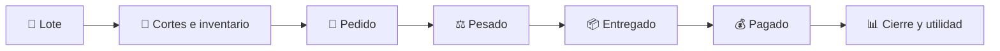
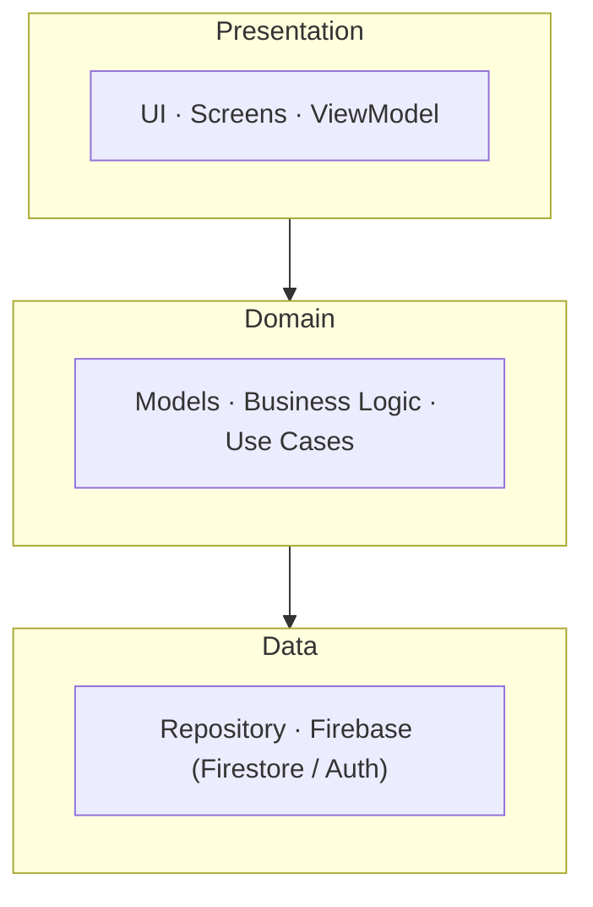
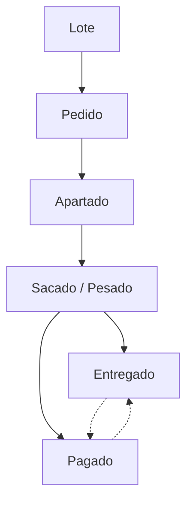

<p align="center">
  
  
  
  
  
  
</p>

<h1 align="center">Arrax</h1>

<p align="center">
  <strong>Gestión de pedidos, inventario y ventas por encargo de carne de cerdo.</strong>
</p>

<p align="center">
  Arrax es una aplicación móvil Android que digitaliza el control de pedidos de carne de cerdo por encargo,
  reemplazando libretas y registros manuales por un sistema centralizado de lotes, cortes, pedidos, clientes,
  inventario y resultados económicos — manteniendo trazabilidad completa desde el pedido hasta la entrega y el pago.
</p>

---

## 📑 Tabla de contenidos

- [Problema](#-problema)
- [Propuesta](#-propuesta)
- [Funcionalidades del MVP](#-funcionalidades-del-mvp)
- [Diseño de interfaz](#-diseño-de-interfaz)
- [Arquitectura](#-arquitectura)
- [Tecnologías](#-tecnologías)
- [Modelo de datos](#-modelo-de-datos)
- [Flujo de negocio](#-flujo-de-negocio)
- [Pantallas principales](#-pantallas-principales)
- [Roadmap](#-roadmap)
- [Alcance actual](#-alcance-actual)
- [Aprendizajes técnicos](#-aprendizajes-técnicos)
- [Sobre el proyecto](#-sobre-el-proyecto)
- [Documentación](#-documentación)
- [Licencia](#-licencia)

---

## 🎯 Problema

Vender un cerdo completo por encargo implica administrar múltiples pedidos, distintos cortes, cantidades expresadas en kilogramos o en dinero, un inventario que cambia en tiempo real y gastos asociados al procesamiento.

Cuando este flujo se lleva de forma manual, aparecen problemas recurrentes:

- Pérdida o duplicación de pedidos.
- Dificultad para conocer el inventario disponible por corte.
- Errores al convertir dinero ↔ peso.
- Falta de seguimiento del estado real de cada pedido.
- Poca visibilidad sobre cuánto se ha vendido y qué queda pendiente.
- Ausencia de control sobre gastos y utilidad final.
- Mayor complejidad operativa durante el pesado y la entrega simultánea de varios pedidos.

**Arrax** centraliza todo este proceso en una sola aplicación móvil, pensada específicamente para el ritmo de trabajo de una carnicería por encargo.

---

## 💡 Propuesta



El flujo principal de cada pedido es:

**Apartado → Sacado/Pesado → Entregado → Pagado**

La entrega y el pago se manejan de forma **independiente**, permitiendo escenarios reales del negocio: un pedido entregado pero pendiente de pago, o pagado por adelantado pero aún no entregado.

---

## ✨ Funcionalidades del MVP

### Gestión de lotes

Cada cerdo vendido se representa como un **lote independiente**, con:

- Fecha de inicio y fecha de cierre.
- Peso total (real o estimado).
- Estado del lote (abierto / cerrado).
- Cortes obtenidos durante el despiece.

Un lote permanece **abierto** mientras exista producto disponible, y se cierra para generar su resumen económico.

### 🥩 Gestión de cortes e inventario

Cada lote tiene un catálogo **configurable** de productos: carne, costilla, codillo, espinazo, chicharrón, manteca, morcilla, higadilla, entre otros.

Cada producto mantiene:

```text
Nombre
Precio por kg
Kg disponibles
Kg vendidos
```

El catálogo no está limitado a una lista fija: se pueden agregar productos según sea necesario.

### 🛒 Gestión de pedidos

Un pedido pertenece a un cliente y a un lote, y puede contener múltiples líneas de producto:

```text
Producto
Cantidad
Precio
Subtotal
```

La cantidad puede introducirse en cualquier dirección:

```text
$ → kg          kg → $
```

**Ejemplo:**

```text
Precio: $180/kg
Cliente solicita: $360
360 / 180 = 2 kg
```

También se contemplan múltiples pedidos realizados en una misma visita (por ejemplo, un comprador que apunta pedidos para distintos destinatarios), manteniéndolos como entidades independientes cuando corresponde.

### ⚖️ Cola de pesado por corte

Una de las funcionalidades centrales de Arrax: el pesado está organizado **por tipo de corte, no por pedido**, reflejando el flujo físico real de trabajo en el despiece.

En lugar de recorrer pedido por pedido:

```text
Pedido Juan                Pedido María
 ├── Costilla                ├── Costilla
 ├── Carne                   ├── Carne
 └── Codillo                 └── Codillo
```

Arrax consolida el trabajo por corte:

```text
COSTILLA
 ├── Juan     → 2.0 kg
 ├── María    → 1.5 kg
 ├── Vecino   → 1.0 kg
 └── Nuera    → 2.0 kg
 ────────────────────
 TOTAL         6.5 kg
```

### 📦 Seguimiento por línea de pedido

Cada línea de producto se marca individualmente como pesada, permitiendo representar pedidos **parcialmente procesados**:

```text
Juan
 ├── ✓ Costilla
 ├── ✓ Codillo
 └── ○ Carne
```

Un pedido pasa a **Sacado/Pesado** únicamente cuando todas sus líneas han sido confirmadas.

### 🎙️ Operación manos libres

La pantalla de pesado está diseñada para un contexto físico exigente: manos ocupadas o sucias, y condiciones de luz (exteriores) que dificultan leer la pantalla.

El diseño contempla:

- Activación mediante botón físico externo (Bluetooth).
- Comandos de voz como alternativa.
- Confirmación por texto a voz.
- Repetición de instrucciones, cambio de corte, cancelación y corrección.

**Ejemplo conceptual de interacción:**

```text
"Costilla para Juan Pérez, dos kilos."
> Confirmar
"Pedido confirmado. Siguiente: María López, kilo y medio."
```

> Esta funcionalidad corresponde a una fase posterior del desarrollo (ver [Roadmap](#-roadmap)).

### 💰 Gastos

Los gastos se asocian directamente a un lote (carnicero, insumos, especias, otros costos de procesamiento), registrando:

```text
Concepto
Categoría
Monto
Fecha
```

### 📊 Cierre de lote

Al cerrar un lote, Arrax genera un resumen económico:

```text
Peso total → Ventas → Gastos → Utilidad neta
```

```text
Utilidad neta = Venta total − Gastos totales
```

También se contemplan pedidos que hayan quedado pendientes de entrega o de pago al momento del cierre.

---

## 🎨 Diseño de interfaz

El diseño visual sigue una estética de **neominimalismo con toques sutiles de glassmorphism**: paleta de neutros cálidos con un acento en terracota, alto contraste y elementos táctiles grandes.

Estas decisiones no son solo estéticas: responden directamente al contexto de uso real de la app, especialmente en la pantalla de pesado, que suele operarse al aire libre y bajo luz solar directa. Legibilidad en exteriores y objetivos táctiles amplios son requisitos funcionales, no detalles cosméticos.

---

## 🏗️ Arquitectura



La separación de capas mantiene la lógica de negocio independiente de la interfaz, facilitando pruebas y evolución del proyecto.

---

## 🧰 Tecnologías

| Tecnología | Uso |
|---|---|
| **Kotlin** | Lenguaje principal |
| **Android** | Plataforma móvil |
| **Jetpack Compose** | Construcción de interfaz |
| **Firebase Authentication** | Autenticación |
| **Cloud Firestore** | Persistencia de datos |
| **Android Studio** | Entorno de desarrollo |

---

## 🗄️ Modelo de datos

La persistencia utiliza **Cloud Firestore** con un modelo orientado a documentos:

```text
/lotes/{loteId}
    ├── productos/{productoId}
    └── gastos/{gastoId}

/clientes/{clienteId}

/pedidos/{pedidoId}
    └── lineas/{lineaId}
```

Decisiones clave del modelo:

- Las **líneas de pedido** conservan información desnormalizada del producto para optimizar lecturas.
- Las operaciones críticas de inventario usan **transacciones de Firestore**, evitando inconsistencias cuando se pesan varios pedidos al mismo tiempo.
- La cola consolidada por corte se resuelve con una consulta `collectionGroup` sobre la subcolección `lineas`.
- El estado `sacado` (pesado) vive **a nivel de línea**, no de pedido, para representar correctamente pedidos parcialmente procesados.

---

## 🔄 Flujo de negocio



> **Nota:** `Entregado` y `Pagado` son estados independientes: un pedido puede entregarse antes de pagarse, o pagarse por adelantado sin haberse entregado aún.

---

## 📱 Pantallas principales

| Pantalla | Contenido |
|---|---|
| **Inicio / Lote activo** | Peso, inventario por corte, pedidos pendientes, estado general |
| **Nuevo pedido** | Selección/creación de cliente, selección de productos, conversión `$ ↔ kg`, resumen |
| **Cola de pesado** | Pedidos agrupados por corte, cantidades a pesar, confirmación por línea, modo manos libres |
| **Cuenta del cliente** | Vista acumulada de pedidos, productos, cantidades, importes y pagos pendientes |
| **Gastos** | Registro de gastos asociados al lote |
| **Cierre** | Resumen de producción, ventas, gastos, utilidad y pedidos pendientes |

> 🖼️ **Capturas de pantalla:** próximamente. El diseño de las seis pantallas principales ya está definido (neominimalismo + alto contraste para exteriores); las capturas se agregarán conforme avance la implementación.

---

## 🗺️ Roadmap

**Fase 1 — Base de datos y CRUD**
- [.] Configuración de Firebase
- [.] Modelo de datos
- [ ] Gestión de lotes, productos y clientes
- [ ] Gestión de pedidos

**Fase 2 — Lógica de negocio**
- [ ] Conversión `$ ↔ kg`
- [ ] Estados de pedidos
- [ ] Inventario y transacciones de Firestore
- [ ] Cuenta acumulada por cliente
- [ ] Cola consolidada por corte

**Fase 3 — Finanzas**
- [ ] Registro de gastos
- [ ] Cálculo de ventas y utilidad
- [ ] Cierre de lote y resumen económico

**Fase 4 — Operación manos libres**
- [ ] Reconocimiento de voz
- [ ] Texto a voz y flujo de pesado por voz

**Fase 5 — Pulido**
- [ ] Alertas de inventario bajo
- [ ] Manejo de peso estimado
- [ ] Accesibilidad y alto contraste
- [ ] Optimización para uso con una sola mano

---

## 🔐 Alcance actual

Arrax está concebido, en esta primera etapa, para **uso familiar e interno** (usuarios administrativos y ayudantes). Por ahora **no** contempla:

- Sistema avanzado de roles y permisos.
- Reportes comparativos históricos.
- Facturación fiscal.
- Resolución avanzada de conflictos entre dispositivos.

Estas funcionalidades podrán evaluarse en versiones posteriores.

---

## 🧠 Aprendizajes técnicos

Algunos de los retos de diseño resueltos durante la fase de modelado:

- **Consultas `collectionGroup`** sobre la subcolección `lineas` para resolver la cola de pesado consolidada por corte, sin necesidad de recorrer pedido por pedido.
- **Transacciones de Firestore** para evitar condiciones de carrera en el inventario cuando varios pedidos se pesan de forma simultánea.
- **Estado a nivel de línea** (`sacado`) en lugar de a nivel de pedido, para representar con precisión pedidos parcialmente procesados.
- **Separación de estados de entrega y pago**, modelando fielmente escenarios reales del negocio en lugar de forzar un flujo lineal simplificado.

---

## 👨‍💻 Sobre el proyecto

Arrax forma parte de mi portafolio de desarrollo de software y es un ejercicio práctico de:

- Desarrollo Android con Kotlin y Jetpack Compose.
- Modelado de datos NoSQL orientado a consultas reales del negocio.
- Arquitectura por capas (Presentation / Domain / Data).
- Diseño de lógica de negocio e inventario.
- Integración con servicios cloud (Firebase).
- Diseño de experiencia de usuario para entornos de trabajo físicos y exigentes.

El objetivo del proyecto no es solo digitalizar una libreta, sino **modelar digitalmente un flujo de trabajo físico real**:

**producto → peso → inventario → pedido → entrega → pago → rentabilidad.**

El proyecto está en evolución activa; algunas funcionalidades descritas corresponden al diseño y roadmap del producto.

**Contacto:**
[GitHub](https://github.com/BehLik) · [LinkedIn](www.linkedin.com/in/likbeh-alejandro-caamal-sabido-6811b7370)

---

## 📄 Documentación

La documentación de requerimientos y arquitectura se encuentra dentro del repositorio, en [`Markdown.md`](./Markdown.md), con el detalle completo de requerimientos funcionales, modelo de datos, flujo de negocio y fases de desarrollo.

---

## ⚖️ Licencia

Este proyecto es de uso personal y forma parte de mi portafolio profesional. La licencia definitiva se definirá conforme avance el proyecto.