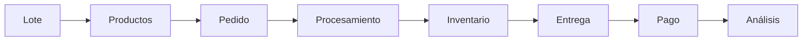
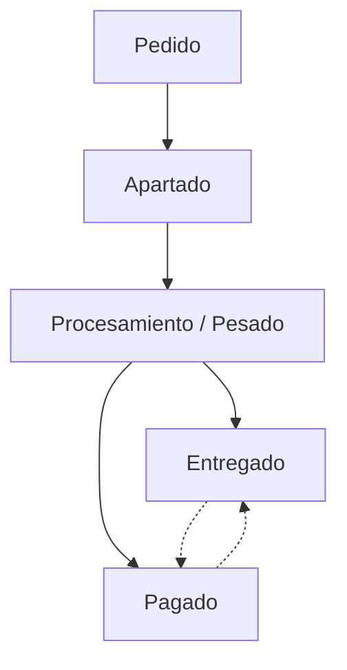

# ARRAX

<p align="center">
  
  
  
  
  
  
  
</p>

<h1 align="center">ARRAX</h1>

<p align="center">
  <strong>Asistente de Registro y Respuesta Automatizada eXtensible</strong>
</p>

<p align="center">
  <em>Una plataforma móvil diseñada para acompañar y automatizar flujos de trabajo físicos en tiempo real.</em>
</p>

---

##  Sobre el proyecto

**ARRAX** es una plataforma móvil Android orientada a la **asistencia, automatización y trazabilidad de procesos operativos**.

El proyecto nace a partir de un escenario real: la gestión de pedidos y procesamiento de productos por encargo en un punto de venta de carne de cerdo.

Sin embargo, el objetivo de ARRAX no es convertirse en un ERP especializado en carnicerías.

El punto de partida es utilizar este escenario como **laboratorio para diseñar una arquitectura de software capaz de modelar, asistir y automatizar procesos físicos que ocurren fuera de una computadora**.

La plataforma busca que la tecnología se adapte al ritmo del trabajador, en lugar de obligar al trabajador a detener su actividad para interactuar con ella.

> **ARRAX no busca reemplazar el proceso de trabajo. Busca acompañarlo.**

---

##  Concepto

La mayoría de las aplicaciones administrativas están diseñadas alrededor de formularios, tablas y registros.

ARRAX parte de una perspectiva diferente:

```text
                    ┌─────────────────────┐
                    │   TRABAJO FÍSICO    │
                    └──────────┬──────────┘
                               │
                               ▼
                    ┌─────────────────────┐
                    │       ARRAX         │
                    │                     │
                    │  Detecta            │
                    │  Registra           │
                    │  Asiste             │
                    │  Automatiza         │
                    └──────────┬──────────┘
                               │
                               ▼
                    ┌─────────────────────┐
                    │  INFORMACIÓN ÚTIL   │
                    └─────────────────────┘
```

La interfaz no debe convertirse en una interrupción del trabajo.

Por ello, el sistema prioriza:

* Interacciones rápidas.
* Información contextual.
* Acciones de un solo toque.
* Automatización de tareas repetitivas.
* Operación con una sola mano.
* Interfaces de alto contraste.
* Interacción por voz.
* Estados persistentes.
* Actualización de información en tiempo real.
* Arquitectura preparada para nuevas capacidades.

---

#  Problema tecnológico

Los procesos físicos de pequeños negocios suelen depender de herramientas que fueron diseñadas para oficinas: hojas de cálculo, libretas, aplicaciones administrativas o sistemas POS tradicionales.

Estas herramientas pueden registrar información, pero no necesariamente comprenden **cómo ocurre físicamente el trabajo**.

En el escenario utilizado para validar ARRAX aparecen problemas como:

* Información distribuida entre registros manuales.
* Dificultad para conocer el estado actual de una operación.
* Errores al convertir unidades de dinero y peso.
* Procesos repetitivos durante el pesado.
* Necesidad de consultar información mientras las manos están ocupadas.
* Falta de trazabilidad entre una solicitud y su procesamiento.
* Actualización manual del inventario.
* Dificultad para representar operaciones parcialmente completadas.
* Poca visibilidad sobre el estado global de una jornada de trabajo.

El reto, por lo tanto, no consiste únicamente en **digitalizar registros**.

Consiste en **modelar digitalmente un proceso físico y convertir ese modelo en una herramienta capaz de asistir al usuario durante la operación**.

---

#  Propuesta

ARRAX utiliza el flujo de pedidos de carne por encargo como primer caso de uso para experimentar con:

```text
INTERACCIÓN
     ↓
CAPTURA DE INFORMACIÓN
     ↓
PROCESAMIENTO
     ↓
ESTADO OPERATIVO
     ↓
AUTOMATIZACIÓN
     ↓
TRAZABILIDAD
     ↓
ANÁLISIS
```

El sistema conecta diferentes eventos que anteriormente podían estar separados:

```text
Lote
  ↓
Productos
  ↓
Pedido
  ↓
Líneas de pedido
  ↓
Pesado
  ↓
Inventario
  ↓
Entrega
  ↓
Pago
  ↓
Resultados
```

Esto permite que cada acción realizada durante el proceso produzca información útil para las siguientes etapas.

---

#  Caso de uso inicial

El primer dominio de aplicación de ARRAX es la venta de carne de cerdo por encargo.

Un lote representa un conjunto de producto disponible para procesamiento y venta.

A partir de ese lote se generan productos, pedidos y operaciones de pesado.

Este escenario permite probar problemas interesantes de ingeniería de software:

* Inventario dinámico.
* Operaciones concurrentes.
* Estados parciales.
* Conversión de unidades.
* Consultas agregadas.
* Trazabilidad.
* Automatización.
* Interacción manos libres.
* Persistencia en la nube.
* Diseño para condiciones físicas reales.

El dominio puede evolucionar posteriormente hacia otros escenarios donde exista un flujo físico similar.

---

#  Capacidades principales

##  Modelado de operaciones

ARRAX representa las entidades y relaciones que forman parte del proceso operativo.

```text
Lote
├── Productos
├── Gastos
│
├── Pedidos
│   └── Líneas
│
└── Resultados
```

La información no se almacena únicamente para mostrarla en una pantalla.

Cada entidad representa un estado real del proceso.

---

##  Sistema de pedidos

Los pedidos pueden contener múltiples líneas de producto.

Cada línea mantiene información sobre:

```text
Producto
Cantidad
Unidad
Precio
Subtotal
Estado de procesamiento
```

La cantidad puede expresarse mediante diferentes unidades de interacción:

```text
$ → kg
kg → $
```

Ejemplo:

```text
Precio: $180/kg

Solicitud:
$360

Conversión:
360 / 180 = 2 kg
```

Esta lógica permite que el usuario trabaje con la forma de solicitud que le resulte más natural.

---

#  Motor de procesamiento por corte

Una de las decisiones de diseño más importantes de ARRAX es que el procesamiento no se organiza únicamente por pedido.

En un entorno físico, el trabajador puede estar procesando un mismo producto para diferentes personas simultáneamente.

En lugar de:

```text
Juan
 ├── Costilla
 ├── Carne
 └── Codillo

María
 ├── Costilla
 ├── Carne
 └── Codillo
```

ARRAX puede reorganizar dinámicamente el trabajo:

```text
COSTILLA

Juan       → 2.0 kg
María      → 1.5 kg
Vecino     → 1.0 kg
Nuera      → 2.0 kg

TOTAL      → 6.5 kg
```

Esto permite que la aplicación siga el **flujo físico de trabajo**, en lugar de imponer un flujo administrativo.

---

#  Estado granular

Los pedidos no siempre se completan de manera uniforme.

Un mismo pedido puede encontrarse en este estado:

```text
Juan Pérez

✓ Costilla
✓ Codillo
○ Carne
```

Por esta razón, ARRAX maneja el estado de procesamiento **a nivel de línea de pedido**, no únicamente a nivel de pedido.

Esto permite representar operaciones parcialmente completadas y mantener una trazabilidad más precisa.

---

#  Interacción manos libres

Una de las líneas de evolución más importantes de ARRAX es la interacción mediante voz.

El objetivo no es agregar un asistente virtual como elemento decorativo.

El objetivo es permitir que el sistema pueda **participar en el flujo de trabajo sin exigir interacción constante con la pantalla**.

Ejemplo:

```text
Usuario:
"ARRAX, ¿qué pedido sigue?"

ARRAX:
"Juan Pérez.
2 kilos de costilla."

Usuario:
"Listo."

ARRAX:
"Pedido registrado.
Siguiente: María López,
1.5 kilos de costilla."
```

La interacción contempla conceptualmente:

* Consultar el siguiente pedido.
* Confirmar una operación.
* Repetir instrucciones.
* Cambiar de corte.
* Consultar información.
* Corregir una operación.
* Avanzar automáticamente al siguiente elemento.

La interacción por voz está planteada como una **capa de asistencia sobre el flujo operativo**, no como un módulo aislado.

---

#  Automatización del flujo

ARRAX busca reducir la cantidad de decisiones manuales necesarias durante operaciones repetitivas.

Por ejemplo:

```text
Confirmar pesado
       ↓
Actualizar línea
       ↓
Actualizar inventario
       ↓
Evaluar estado del pedido
       ↓
Determinar siguiente operación
       ↓
Mostrar / anunciar siguiente pedido
```

El usuario no necesita regresar constantemente a diferentes pantallas.

El sistema mantiene el contexto y continúa el flujo.

---

#  Persistencia y consistencia

ARRAX utiliza **Cloud Firestore** como capa de persistencia.

El modelo está orientado a documentos y diseñado alrededor de las consultas necesarias para resolver el flujo operativo.

```text
/lotes/{loteId}
    ├── productos/{productoId}
    └── gastos/{gastoId}

/clientes/{clienteId}

/pedidos/{pedidoId}
    └── lineas/{lineaId}
```

Las líneas de pedido conservan información relevante del producto para reducir lecturas innecesarias.

Las operaciones críticas de inventario utilizan **transacciones de Firestore**, evitando inconsistencias cuando diferentes operaciones modifican el inventario.

La cola de procesamiento por corte puede resolverse mediante consultas `collectionGroup` sobre las líneas de pedido.

---

#  Arquitectura

ARRAX utiliza una arquitectura por capas:

```text
┌──────────────────────────────────┐
│          PRESENTATION            │
│                                  │
│  Compose · Screens · ViewModel   │
└────────────────┬─────────────────┘
                 │
                 ▼
┌──────────────────────────────────┐
│             DOMAIN               │
│                                  │
│ Models · Use Cases · Rules       │
└────────────────┬─────────────────┘
                 │
                 ▼
┌──────────────────────────────────┐
│              DATA                │
│                                  │
│ Repository · Firebase · Auth     │
└──────────────────────────────────┘
```

La separación permite que la lógica de negocio no dependa directamente de la interfaz.

Esto facilita:

* Pruebas.
* Mantenimiento.
* Sustitución de fuentes de datos.
* Incorporación de nuevas interfaces.
* Evolución hacia nuevos dominios.
* Integración de nuevas capacidades de automatización.

---

#  Stack tecnológico

| Tecnología                       | Uso                        |
| -------------------------------- | -------------------------- |
| **Kotlin**                       | Lenguaje principal         |
| **Android**                      | Plataforma                 |
| **Jetpack Compose**              | UI declarativa             |
| **Firebase Authentication**      | Autenticación              |
| **Cloud Firestore**              | Persistencia               |
| **Android Studio**               | Desarrollo                 |
| **Clean / Layered Architecture** | Organización del sistema   |
| **Firestore Transactions**       | Consistencia de inventario |
| **Collection Group Queries**     | Consultas agregadas        |

---

#  Diseño de experiencia

La interfaz está diseñada bajo un principio:

> **La tecnología debe adaptarse al contexto físico del usuario.**

Por ello se utiliza una combinación de:

* Neominimalismo.
* Glassmorphism sutil.
* Alto contraste.
* Tipografía de lectura rápida.
* Elementos táctiles grandes.
* Jerarquía visual fuerte.
* Estados claros.
* Animaciones discretas.
* Información contextual.

El diseño considera escenarios donde el usuario puede encontrarse:

* Trabajando de pie.
* Con una sola mano disponible.
* Con las manos sucias.
* Bajo iluminación exterior.
* Moviéndose constantemente entre diferentes tareas.

La pantalla no debe exigir atención innecesaria.

---

#  Interfaces principales

### Dashboard

Proporciona una visión contextual del estado actual:

* Lote activo.
* Inventario.
* Pedidos pendientes.
* Pedidos por cobrar.
* Próximas operaciones.

### Nuevo pedido

Permite crear un pedido rápidamente sin convertir la operación en un formulario extenso.

### Cola operativa

Presenta las operaciones pendientes agrupadas según el flujo físico de trabajo.

### Cuenta del cliente

Mantiene trazabilidad de pedidos, visitas, entregas y pagos.

### Gastos

Permite registrar los costos asociados al procesamiento.

### Reporte

Transforma los eventos registrados durante la operación en información financiera y operativa.

---

#  Flujo operativo



A diferencia de un flujo administrativo tradicional, el procesamiento y el pago no necesariamente ocurren de manera lineal.



Un pedido puede:

* Ser procesado y posteriormente entregado.
* Ser entregado y quedar pendiente de pago.
* Ser pagado anticipadamente.
* Permanecer parcialmente procesado.

El modelo de datos representa estos escenarios sin forzar una secuencia artificial.

---

#  Información generada

Uno de los objetivos de ARRAX es que las operaciones cotidianas generen información reutilizable.

```text
OPERACIÓN
    ↓
EVENTO
    ↓
ESTADO
    ↓
DATOS
    ↓
MÉTRICAS
    ↓
DECISIONES
```

A partir de los datos registrados se pueden obtener:

* Ventas.
* Inventario.
* Productos con mayor movimiento.
* Pedidos pendientes.
* Cuentas por cobrar.
* Gastos.
* Utilidad.
* Rendimiento por lote.

Esto permite que el sistema evolucione desde una herramienta de registro hacia una **plataforma de asistencia y análisis operativo**.

---

#  Roadmap

## Fase 1 — Core Platform

* [ ] Configuración de Firebase
* [ ] Modelo de datos
* [ ] Arquitectura base
* [ ] Gestión de lotes
* [ ] Gestión de productos
* [ ] Gestión de clientes
* [ ] Gestión de pedidos

---

## Fase 2 — Operational Engine

* [ ] Conversión `$ ↔ kg`
* [ ] Estados de pedidos
* [ ] Estado granular por línea
* [ ] Inventario dinámico
* [ ] Transacciones de Firestore
* [ ] Cola consolidada por corte
* [ ] Cuenta acumulada por cliente

---

## Fase 3 — Financial Layer

* [ ] Registro de gastos
* [ ] Cálculo de ventas
* [ ] Cálculo de utilidad
* [ ] Cierre de lote
* [ ] Reportes operativos
* [ ] Indicadores de rendimiento

---

## Fase 4 — Assisted Interaction

* [ ] Reconocimiento de voz
* [ ] Texto a voz
* [ ] Comandos contextuales
* [ ] Flujo manos libres
* [ ] Confirmaciones por voz
* [ ] Navegación contextual
* [ ] Integración con botón físico / Bluetooth

---

## Fase 5 — Intelligence & Automation

* [ ] Recomendaciones operativas
* [ ] Detección de patrones
* [ ] Predicción de demanda
* [ ] Automatización de tareas repetitivas
* [ ] Alertas contextuales
* [ ] Análisis histórico
* [ ] Personalización del flujo

---

## Fase 6 — Extensibilidad

La arquitectura de ARRAX está planteada para que el dominio inicial pueda evolucionar.

Posibles líneas futuras:

```text
                 ARRAX CORE
                     │
       ┌─────────────┼─────────────┐
       │             │             │
   Retail       Operaciones    Servicios
       │             │             │
       ▼             ▼             ▼
  Inventario     Automatización  Asistencia
       │             │             │
       └─────────────┼─────────────┘
                     │
                     ▼
             Inteligencia
```

La intención es que las capacidades desarrolladas para un escenario puedan reutilizarse en otros contextos donde exista un flujo físico susceptible de digitalización.

---

#  Alcance actual

ARRAX se encuentra en desarrollo.

El primer escenario de validación está orientado a operaciones internas y familiares de venta por encargo.

Actualmente el proyecto prioriza:

* Arquitectura.
* Modelado de datos.
* Flujo operativo.
* Gestión de pedidos.
* Inventario.
* Procesamiento por corte.
* Persistencia cloud.
* Experiencia de usuario.
* Preparación para interacción manos libres.

Funcionalidades avanzadas como inteligencia contextual, automatización extendida y análisis predictivo forman parte de la evolución futura del proyecto.

---

#  Retos técnicos

ARRAX permite explorar problemas de ingeniería que van más allá de un CRUD tradicional.

### Consultas agregadas

La cola de procesamiento requiere obtener información distribuida entre diferentes pedidos.

Para ello se contempla el uso de consultas `collectionGroup` sobre la subcolección `lineas`.

### Consistencia

El inventario representa un recurso compartido.

Las operaciones críticas utilizan transacciones para reducir el riesgo de condiciones de carrera.

### Estados parciales

Un pedido no necesariamente termina de procesarse de forma simultánea.

El estado a nivel de línea permite representar correctamente esta situación.

### Estados independientes

Entrega y pago se manejan como estados independientes para representar escenarios reales.

### Diseño contextual

La interfaz se diseña considerando las condiciones físicas donde se utilizará.

### Interacción asistida

La futura integración de voz transforma la aplicación de una interfaz puramente visual a una interfaz multimodal.

---

#  Evolución del proyecto

ARRAX está planteado como un proyecto evolutivo.

La primera versión resuelve un problema concreto, pero su arquitectura busca evitar que el sistema quede limitado al dominio inicial.

La evolución prevista es:

```text
Registro
   ↓
Gestión
   ↓
Asistencia
   ↓
Automatización
   ↓
Inteligencia
```

El objetivo final no es crear simplemente otra aplicación de administración.

Es explorar cómo una aplicación móvil puede convertirse en una **capa digital de asistencia sobre procesos físicos reales**.

---

# Sobre el proyecto

ARRAX forma parte de mi portafolio de desarrollo de software.

El proyecto funciona como un entorno práctico para aplicar y experimentar con:

* Desarrollo Android moderno.
* Kotlin.
* Jetpack Compose.
* Arquitectura por capas.
* Modelado NoSQL.
* Cloud Firestore.
* Transacciones distribuidas.
* Consultas agregadas.
* Diseño de sistemas orientados a eventos operativos.
* Automatización.
* Interacción humano-computadora.
* Interfaces multimodales.
* Diseño UX contextual.
* Sistemas extensibles.

El principal aprendizaje del proyecto no consiste únicamente en construir una aplicación funcional.

Consiste en aprender a **transformar un proceso físico en un modelo digital capaz de evolucionar**.

---

#  Filosofía

> **ARRAX no le dice al usuario cómo trabajar.**
>
> **ARRAX aprende a acompañar cómo trabaja.**

El sistema comienza con un caso concreto y evoluciona alrededor de una pregunta:

> **¿Cómo puede la tecnología desaparecer del camino y, al mismo tiempo, hacer que el trabajo sea más sencillo?**

---

#  Capturas

Las interfaces se incorporarán conforme avance la implementación.

La dirección visual utiliza:

* Neominimalismo suave.
* Glassmorphism sutil.
* Alto contraste.
* Componentes táctiles amplios.
* Diseño contextual.
* Interacción manos libres.

---

#  Documentación

La documentación técnica del proyecto incluye:

* Requerimientos.
* Arquitectura.
* Modelo de datos.
* Flujo operativo.
* Diseño de interfaz.
* Roadmap.
* Decisiones técnicas.

---

#  Estado

**En desarrollo activo.**

ARRAX se encuentra en evolución y algunas capacidades descritas en este documento pertenecen al roadmap del producto.

---

# Contacto

**GitHub:** [tu perfil de GitHub](https://github.com/BehLik)

**LinkedIn:** [tu perfil de LinkedIn](www.linkedin.com/in/likbeh-alejandro-caamal-sabido-6811b7370)

---

# Licencia

Proyecto personal desarrollado como parte de mi portafolio profesional.

La licencia definitiva se definirá conforme evolucione el proyecto.
