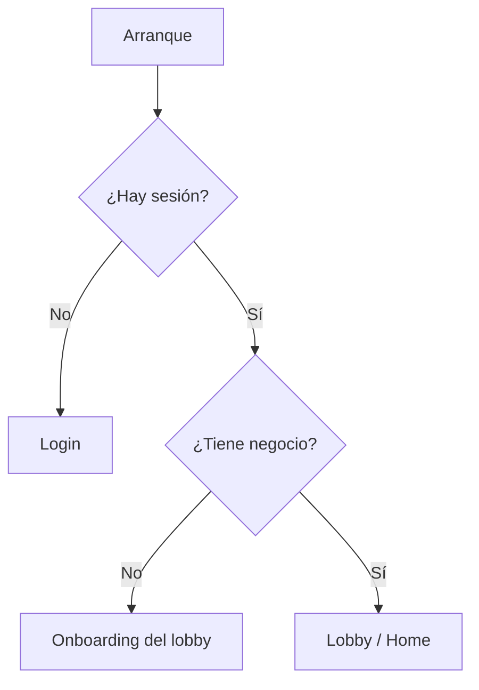
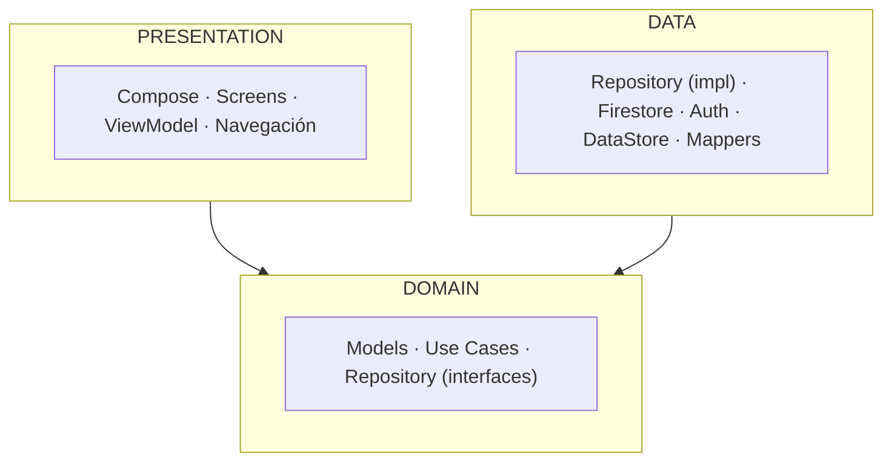
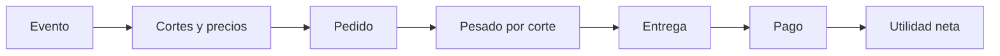
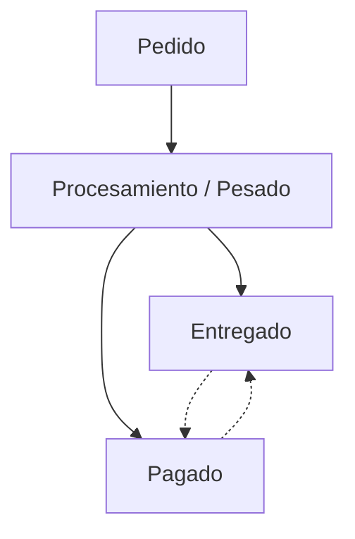

<p align="center">
  
  
  
  
  
  
  
  
</p>

<h1 align="center">ARRAX</h1>

<p align="center">
  <strong>Asistente de Registro y Respuesta Automatizada eXtensible</strong>
</p>

<p align="center">
  <em>Una plataforma móvil diseñada para acompañar y automatizar flujos de trabajo físicos en tiempo real.</em>
</p>

---

## Sobre el proyecto

**ARRAX** es una plataforma móvil Android orientada a la **asistencia, automatización y trazabilidad de procesos operativos**.

El proyecto nace a partir de un escenario real: la gestión de pedidos y el procesamiento de productos por encargo en un negocio familiar de venta de carne de cerdo, donde los pedidos se llevaban en listas de papel y era común perder registros o confundir pedidos.

Sin embargo, el objetivo de ARRAX no es convertirse en un ERP especializado en carnicerías.

El punto de partida es utilizar este escenario como **laboratorio para diseñar una arquitectura de software capaz de modelar, asistir y automatizar procesos físicos que ocurren fuera de una computadora**.

La plataforma busca que la tecnología se adapte al ritmo del trabajador, en lugar de obligar al trabajador a detener su actividad para interactuar con ella.

> **ARRAX no busca reemplazar el proceso de trabajo. Busca acompañarlo.**

---

## Estado de implementación

| Fase | Alcance | Estado |
| ---- | ------- | ------ |
| **0** | Cimientos: arquitectura por capas, design system, inyección de dependencias, configuración de Firebase | Completada |
| **1** | Autenticación: inicio de sesión, registro y recuperación de contraseña contra Firebase Auth | Completada |
| **2** | Lobby multi-tenant: crear un negocio o unirse a uno con código, y lista de eventos | Completada |
| **3** | Eventos: creación en 3 pasos, detalle en tiempo real y cierre de evento | Completada |
| **4** | Pedidos, pesaje por corte y modo manos libres | En desarrollo |
| **5** | Capa financiera: gastos, ventas, utilidad neta y reportes | Planeada |
| **6** | Inteligencia y automatización | Planeada |
| **7** | Extensibilidad a otros dominios | Planeada |

---

## Concepto

La mayoría de las aplicaciones administrativas están diseñadas alrededor de formularios, tablas y registros.

ARRAX parte de una perspectiva diferente:

```text
                    ┌─────────────────────┐
                    │   TRABAJO FÍSICO    │
                    └──────────┬──────────┘
                               │
                               ▼
                    ┌─────────────────────┐
                    │       ARRAX         │
                    │                     │
                    │  Detecta            │
                    │  Registra           │
                    │  Asiste             │
                    │  Automatiza         │
                    └──────────┬──────────┘
                               │
                               ▼
                    ┌─────────────────────┐
                    │  INFORMACIÓN ÚTIL   │
                    └─────────────────────┘
```

La interfaz no debe convertirse en una interrupción del trabajo. Por ello, el sistema prioriza:

* Interacciones rápidas.
* Información contextual.
* Acciones de un solo toque.
* Automatización de tareas repetitivas.
* Operación con una sola mano.
* Interfaces de alto contraste.
* Interacción por voz y por botón físico.
* Estados persistentes.
* Actualización de información en tiempo real.
* Arquitectura preparada para nuevas capacidades.

---

## Problema tecnológico

Los procesos físicos de pequeños negocios suelen depender de herramientas que fueron diseñadas para oficinas: hojas de cálculo, libretas, aplicaciones administrativas o sistemas POS tradicionales.

Estas herramientas pueden registrar información, pero no necesariamente comprenden **cómo ocurre físicamente el trabajo**.

En el escenario utilizado para validar ARRAX aparecen problemas como:

* Información distribuida entre registros manuales.
* Dificultad para conocer el estado actual de una operación.
* Errores al convertir entre dinero y peso.
* Procesos repetitivos durante el pesado.
* Necesidad de consultar información mientras las manos están ocupadas.
* Falta de trazabilidad entre una solicitud y su procesamiento.
* Actualización manual del inventario.
* Dificultad para representar operaciones parcialmente completadas.
* Poca visibilidad sobre el estado global de una jornada de trabajo.

El reto no consiste únicamente en **digitalizar registros**, sino en **modelar digitalmente un proceso físico y convertir ese modelo en una herramienta capaz de asistir al usuario durante la operación**.

---

## Caso de uso inicial

El primer dominio de aplicación de ARRAX es la venta de carne de cerdo por encargo.

Los animales se crían con alimento propio y la mayoría de los cortes se vende por pedido antes de procesar al animal. ARRAX gestiona el ciclo completo: desde la creación del evento hasta el pesado de cada corte, la entrega, el seguimiento de pagos y la utilidad neta.

```text
Evento
  ├── Lotes (cada cerdo, como referencia)
  ├── Cortes a vender, con su precio del evento
  └── Pedidos
        └── Líneas (una por corte)
              ├── Estado de pesado
              ├── Estado de entrega
              └── Estado de pago
```

Este escenario permite probar problemas interesantes de ingeniería de software:

* Inventario dinámico.
* Operaciones concurrentes.
* Estados parciales.
* Conversión de unidades.
* Consultas agregadas.
* Trazabilidad.
* Multi-tenencia.
* Automatización.
* Interacción manos libres.
* Persistencia en la nube con soporte sin conexión.
* Diseño para condiciones físicas reales.

El dominio puede evolucionar posteriormente hacia otros escenarios donde exista un flujo físico similar.

---

## Modelo de dominio

**Evento.** Es el contenedor de nivel superior. Representa una jornada de venta y puede incluir varios lotes. Al crearlo se captura su nombre, fecha y cantidad de cerdos.

**Lote.** Es una etiqueta de referencia ligera para cada animal. No tiene un árbol de costos propio.

**Corte.** Los cortes provienen de un catálogo editable en Firestore, con ocho cortes conocidos sembrados como sugerencia: carne, costilla, espinazo, codillo, chicharra, higadilla, morcilla y manteca. Se agregó también la cabeza del cerdo. Quien crea el evento elige qué cortes vende y define su precio **para ese evento**.

**Pedido y línea.** Un pedido pertenece a un cliente y contiene una línea por corte. El estado de procesamiento vive **a nivel de línea**, no de pedido.

**Cliente.** Los clientes son reutilizables entre eventos dentro del mismo negocio; no se vuelven a registrar en cada evento.

### Reglas de negocio

* Los dos flujos de pesado (por corte o por cliente) son mutuamente excluyentes dentro de una sesión.
* El crédito y la deuda se manejan por evento.
* La utilidad neta se reporta a nivel de evento.
* Entrega y pago son estados independientes: un cliente puede pagar sin haber recibido, o recibir sin haber pagado.
* Los precios se definen al crear el evento; agregar cortes sobre la marcha queda fuera del alcance actual.

---

## Multi-tenencia y roles

ARRAX es multi-tenant: varias familias pueden usar la aplicación, cada una con sus propios clientes, eventos y catálogo de cortes, aislados entre sí.

* **Crear un negocio.** El primer usuario registra el negocio durante el onboarding.
* **Unirse a un negocio.** Otros usuarios entran con un código.
* **Roles.** Algunas acciones, como crear o cerrar un evento, están reservadas al administrador.
* **Sesión local.** El negocio activo y el rol se guardan en DataStore para decidir la pantalla de arranque.

La pantalla inicial se resuelve al abrir la app:


```mermaid
flowchart TD
    A["Arranque"] --> B{"¿Hay sesión?"}
    B -- No --> C["Login"]
    B -- Sí --> D{"¿Tiene negocio?"}
    D -- No --> E["Onboarding del lobby"]
    D -- Sí --> F["Lobby / Home"]
```

---

## Eventos (Fase 3)

### Creación en 3 pasos

Disponible solo para administradores.

1. **Datos básicos.** Nombre, fecha y cantidad de cerdos (mínimo 1).
2. **Selección de cortes.** Se eligen los cortes que se venderán en el evento.
3. **Precios.** Cada corte seleccionado necesita un precio mayor a cero para poder confirmar.

La creación se ejecuta como un **write batch**: el evento y un documento por cada corte seleccionado se escriben juntos. Si algo falla, no queda un evento a medias.

### Detalle del evento

* Se suscribe al evento **en tiempo real**, de modo que si otro dispositivo lo cierra mientras se visualiza, la pantalla se actualiza.
* Muestra una tarjeta de resumen del evento.
* El botón **Cerrar evento** solo aparece para administradores y solo si el evento está abierto. Pide confirmación antes de ejecutarse, porque no se puede revertir desde la interfaz.

**Criterio de salida:** un administrador crea un evento completo de punta a punta, aparece de inmediato en el lobby para todos los usuarios del negocio (incluso sin conexión, gracias a la caché de Firestore) y puede cerrarse.

---

## Capacidades principales

### Sistema de pedidos

Cada línea de pedido mantiene información sobre:

```text
Corte
Cantidad
Unidad
Precio vigente en el evento
Subtotal
Estado de procesamiento
```

Un pedido puede expresarse en kilogramos o en pesos. El sistema calcula la conversión automáticamente con el precio del corte en ese evento (regla de tres), en ambas direcciones:

```text
$ → kg
kg → $
```

Ejemplo:

```text
Precio: $180/kg

Solicitud:
$360

Conversión:
360 / 180 = 2 kg
```

El usuario trabaja con la forma de solicitud que le resulte más natural.

### Motor de procesamiento por corte

Una de las decisiones de diseño más importantes es que el procesamiento no se organiza únicamente por pedido. En un entorno físico, el trabajador procesa un mismo corte para varias personas a la vez.

En lugar de:

```text
Juan
 ├── Costilla
 ├── Carne
 └── Codillo

María
 ├── Costilla
 ├── Carne
 └── Codillo
```

ARRAX reorganiza el trabajo siguiendo el flujo físico:

```text
COSTILLA

Juan       → 2.0 kg
María      → 1.5 kg
Vecino     → 1.0 kg
Nuera      → 2.0 kg

TOTAL      → 6.5 kg
```

La cola se ordena por tipo de corte a través de todos los pedidos: primero toda la costilla, luego toda la carne, y así sucesivamente. Es un requerimiento operativo directo del trabajo físico.

### Estado granular

Los pedidos no siempre se completan de manera uniforme:

```text
Juan Pérez

✓ Costilla
✓ Codillo
○ Carne
```

Por eso cada línea tiene un indicador de pesado (`sacado`) y el estado se maneja a nivel de línea. Esto permite representar operaciones parcialmente completadas y mantener una trazabilidad precisa.

---

## Interacción manos libres (Fase 4, en desarrollo)

El objetivo no es agregar un asistente virtual decorativo, sino permitir que el sistema **participe en el flujo de trabajo sin exigir interacción constante con la pantalla**.

### Implementación actual

* **Disparador físico.** Un botón Bluetooth HID confirma el pesado sin tocar la pantalla. La actividad de pesado captura las teclas `ENTER`, `HEADSETHOOK`, `MEDIA_PLAY_PAUSE` y `VOLUME_UP` a través de `dispatchKeyEvent()`.
* **Confirmación por voz.** `TtsHelper` envuelve `android.speech.tts.TextToSpeech`. Funciona en el dispositivo, sin API externa y sin permiso de micrófono.
* **Flujo de confirmación.** Una vibración corta de 150 ms y después el anuncio hablado con el corte y el peso confirmados.
* **Hardware.** Se prototipa con un clicker Bluetooth económico y está previsto migrar a un pedal para uso en producción.

```text
Botón Bluetooth
      ↓
Vibración (150 ms)
      ↓
"Confirmado: costilla, 2.0 kilos."
      ↓
Actualizar línea → siguiente pedido
```

### Siguientes pasos

* Reconocimiento de voz con el micrófono del dispositivo para comandos contextuales.
* Consultar el siguiente pedido, repetir instrucciones, cambiar de corte y corregir una operación.
* Reflejar en el listado manos libres los pedidos especificados por monto, mostrando el peso objetivo calculado.

Ejemplo del flujo previsto:

```text
Usuario:
"ARRAX, ¿qué pedido sigue?"

ARRAX:
"Juan Pérez.
2 kilos de costilla."

Usuario:
"Listo."

ARRAX:
"Pedido registrado.
Siguiente: María López,
1.5 kilos de costilla."
```

La voz está planteada como una **capa de asistencia sobre el flujo operativo**, no como un módulo aislado.

---

## Automatización del flujo

ARRAX busca reducir la cantidad de decisiones manuales necesarias durante operaciones repetitivas:

```text
Confirmar pesado
       ↓
Actualizar línea
       ↓
Actualizar inventario
       ↓
Evaluar estado del pedido
       ↓
Determinar siguiente operación
       ↓
Mostrar / anunciar siguiente pedido
```

El usuario no necesita regresar constantemente a diferentes pantallas. El sistema mantiene el contexto y continúa el flujo.

---

## Persistencia y consistencia

ARRAX usa **Cloud Firestore** como capa de persistencia. El modelo está orientado a documentos y diseñado alrededor de las consultas que necesita el flujo operativo.

El aislamiento entre negocios se resuelve **en la ruta de Firestore** (`tenants/{tenantId}/...`), no como un campo dentro de los modelos de dominio.

```text
/tenants/{tenantId}
    ├── events/{eventId}       → nombre, fecha, cantidad de cerdos, estado
    │     └── cortes del evento con su precio
    ├── clientes
    └── catálogo de cortes
```

*(Estructura conceptual; los nombres exactos de las colecciones pueden variar.)*

* **Write batch** para crear un evento con sus cortes: todo o nada.
* **Transacciones** para las operaciones críticas de inventario, evitando condiciones de carrera.
* **Consultas `collectionGroup`** sobre las líneas de pedido para construir la cola por corte.
* **Listeners en tiempo real** para el detalle del evento y la lista del lobby.
* **Caché sin conexión** de Firestore: lo creado sin red aparece de inmediato para el usuario.
* **Líneas desnormalizadas.** Las líneas conservan información relevante del corte para reducir lecturas.

---

## Arquitectura

ARRAX usa una arquitectura por capas con inyección de dependencias mediante Hilt.


```mermaid
flowchart TD
    subgraph P["PRESENTATION"]
        P1["Compose · Screens · ViewModel · Navegación"]
    end
    subgraph D["DOMAIN"]
        D1["Models · Use Cases · Repository (interfaces)"]
    end
    subgraph DA["DATA"]
        DA1["Repository (impl) · Firestore · Auth · DataStore · Mappers"]
    end
    P --> D
    DA --> D
```

La capa de dominio no depende de la interfaz ni de Firebase; la capa de datos implementa sus interfaces. Esto facilita:

* Pruebas.
* Mantenimiento.
* Sustitución de fuentes de datos.
* Incorporación de nuevas interfaces.
* Evolución hacia nuevos dominios.

### Estructura del proyecto

```text
com.example.arrax
├── ArraxApplication          → @HiltAndroidApp
├── core
│   ├── common
│   ├── designsystem          → componentes Arx* y tema
│   └── navigation            → Routes
├── data
│   ├── local                 → sesión (DataStore)
│   ├── mapper
│   ├── remote                → data sources de Firestore
│   └── repository
├── di                        → módulos de Hilt
├── domain
│   ├── model                 → Event, EventCut, EventWithCuts, User...
│   ├── repository
│   └── usecase               → event/create, event/detail...
└── ui
    ├── root                  → MainActivity, AppStartViewmodel y NavHost
    └── screen
        ├── auth              → login, register, forgotpassword
        ├── lobby             → onboarding, home
        └── events            → create, detail
              └── cada feature: Screen + State + Viewmodel + component/
```

### Arranque de la app

`MainActivity` es la única actividad con el filtro `LAUNCHER`. Está anotada con `@AndroidEntryPoint` y monta `ArraxNavHost`, que consulta a `AppStartViewmodel` para decidir la pantalla inicial según la sesión y el negocio guardado.

---

## Stack tecnológico

| Tecnología | Uso |
| ---------- | --- |
| **Kotlin 2.1** | Lenguaje principal |
| **Android** (minSdk 26, compileSdk 36) | Plataforma |
| **Jetpack Compose** (BOM 2024.09) + **Material 3** | UI declarativa |
| **Navigation Compose** | Navegación |
| **Hilt** + **KSP** | Inyección de dependencias |
| **Firebase Authentication** | Autenticación |
| **Cloud Firestore** (Firebase BoM 34) | Persistencia |
| **Firebase Crashlytics** | Reporte de errores |
| **DataStore Preferences** | Sesión local |
| **Android TextToSpeech** | Confirmaciones por voz |
| **Clean / Layered Architecture** | Organización del sistema |
| **Firestore Transactions / Write Batch** | Consistencia |
| **Collection Group Queries** | Consultas agregadas |

---

## Diseño de experiencia

La interfaz sigue un principio:

> **La tecnología debe adaptarse al contexto físico del usuario.**

Se utiliza una combinación de:

* Neominimalismo.
* Glassmorphism sutil.
* Alto contraste, como decisión funcional para lectura bajo el sol y no solo estética.
* Tipografía de lectura rápida.
* Elementos táctiles grandes, pensados para manos ocupadas o sucias.
* Jerarquía visual fuerte.
* Estados claros.
* Animaciones discretas.

El diseño considera escenarios donde el usuario puede estar trabajando de pie, con una sola mano disponible, con las manos sucias, bajo iluminación exterior o moviéndose constantemente entre tareas.

Los componentes reutilizables viven en un design system propio, con prefijo `Arx` (botones, campos, tarjetas, chips de estado, diálogos, selector de cantidad, estados vacíos y barra superior).

---

## Interfaces

El diseño completo contempla **21 pantallas en 8 módulos**. Las principales:

* **Autenticación:** inicio de sesión, registro y recuperación de contraseña.
* **Lobby:** onboarding (crear o unirse a un negocio) y lista de eventos.
* **Eventos:** creación en 3 pasos y detalle con acciones de administrador.
* **Nuevo pedido:** captura rápida de un pedido en kg o en pesos.
* **Cola operativa:** pendientes agrupados por corte, con pesado manos libres.
* **Cuenta del cliente:** trazabilidad de pedidos, entregas y pagos.
* **Gastos:** costos asociados al procesamiento.
* **Reporte:** resultados financieros y operativos del evento.

---

## Flujo operativo


```mermaid
flowchart LR
    A["Evento"] --> B["Cortes y precios"]
    B --> C["Pedido"]
    C --> D["Pesado por corte"]
    D --> E["Entrega"]
    E --> F["Pago"]
    F --> G["Utilidad neta"]
```

Procesamiento, entrega y pago no necesariamente ocurren de manera lineal:


```mermaid
flowchart TD
    P["Pedido"] --> S["Procesamiento / Pesado"]
    S --> E["Entregado"]
    S --> G["Pagado"]
    E -.-> G
    G -.-> E
```

Un pedido puede:

* Ser procesado y posteriormente entregado.
* Ser entregado y quedar pendiente de pago.
* Ser pagado anticipadamente.
* Permanecer parcialmente procesado.

El modelo de datos representa estos escenarios sin forzar una secuencia artificial.

---

## Información generada

Las operaciones cotidianas generan información reutilizable:

```text
OPERACIÓN → EVENTO → ESTADO → DATOS → MÉTRICAS → DECISIONES
```

A partir de los datos registrados se pueden obtener:

* Ventas.
* Inventario.
* Cortes con mayor movimiento.
* Pedidos pendientes.
* Cuentas por cobrar.
* Gastos.
* Utilidad neta del evento.

La exportación de datos para decisiones operativas es una consideración de diseño, no un bloqueo actual.

---

## Roadmap

### Fase 0 — Cimientos

- [x] Arquitectura por capas y estructura de paquetes
- [x] Design system `Arx*`
- [x] Configuración de Firebase
- [x] Inyección de dependencias con Hilt
- [x] Proyecto compilando sin UI

### Fase 1 — Autenticación

- [x] Inicio de sesión
- [x] Registro
- [x] Recuperación de contraseña

### Fase 2 — Lobby multi-tenant

- [x] Onboarding: crear negocio
- [x] Onboarding: unirse con código
- [x] Sesión local y pantalla de arranque según estado
- [x] Lista de eventos del negocio

### Fase 3 — Eventos

- [x] Creación de evento en 3 pasos (solo administrador)
- [x] Selección de cortes y precios por evento
- [x] Escritura atómica del evento con sus cortes
- [x] Detalle del evento en tiempo real
- [x] Cierre de evento con confirmación

### Fase 4 — Pedidos, pesaje y manos libres *(en desarrollo)*

- [ ] Gestión de clientes reutilizables
- [ ] Creación de pedidos con conversión `$ ↔ kg`
- [ ] Estado granular por línea
- [ ] Cola consolidada por corte
- [ ] Inventario dinámico con transacciones
- [ ] Cuenta acumulada por cliente
- [ ] Disparador Bluetooth y confirmación por TTS
- [ ] Reconocimiento de voz y comandos contextuales

### Fase 5 — Capa financiera

- [ ] Registro de gastos
- [ ] Cálculo de ventas y utilidad neta
- [ ] Reportes operativos
- [ ] Indicadores de rendimiento

### Fase 6 — Inteligencia y automatización

- [ ] Recomendaciones operativas
- [ ] Detección de patrones
- [ ] Predicción de demanda
- [ ] Alertas contextuales
- [ ] Análisis histórico

### Fase 7 — Extensibilidad

La arquitectura está planteada para que el dominio inicial pueda evolucionar hacia otros contextos con un flujo físico similar:

```text
                 ARRAX CORE
                     │
       ┌─────────────┼─────────────┐
       │             │             │
   Retail       Operaciones    Servicios
       │             │             │
       ▼             ▼             ▼
  Inventario     Automatización  Asistencia
       │             │             │
       └─────────────┼─────────────┘
                     │
                     ▼
             Inteligencia
```

---

## Retos técnicos

ARRAX permite explorar problemas de ingeniería que van más allá de un CRUD tradicional.

* **Consultas agregadas.** La cola necesita información distribuida entre pedidos; se resuelve con `collectionGroup` sobre las líneas.
* **Consistencia.** El inventario es un recurso compartido; las operaciones críticas usan transacciones.
* **Atomicidad.** Crear un evento implica varios documentos que deben escribirse juntos.
* **Estados parciales.** Un pedido no termina de procesarse de forma simultánea; el estado vive en la línea.
* **Estados independientes.** Entrega y pago se modelan por separado.
* **Multi-tenencia.** El aislamiento se resuelve en la estructura de datos y no depende de filtros en la interfaz.
* **Trabajo sin conexión.** El negocio opera en condiciones de conectividad variable, por lo que la app se apoya en la caché de Firestore.
* **Diseño contextual.** La interfaz se diseña para las condiciones físicas donde se usa.
* **Interacción asistida.** La voz y el botón físico convierten la app en una interfaz multimodal.

### Aprendizajes técnicos

* Desde Firebase BoM 34, las extensiones de Kotlin están integradas en los módulos principales, por lo que ya no se usan los artefactos con sufijo `-ktx`.
* Hilt exige una clase `Application` con `@HiltAndroidApp` registrada en el manifest y `@AndroidEntryPoint` en la actividad que usa `hiltViewModel()`.
* Con `enableEdgeToEdge()`, cada pantalla debe manejar sus propios insets; un `Scaffold` extra en la actividad duplica el relleno.
* Registrar las rutas de navegación antes de habilitar los botones que llevan a ellas evita cierres por rutas inexistentes.
* Modelar el tenant en la ruta de Firestore mantiene el dominio limpio.

---

## Cómo ejecutar el proyecto

1. Clona el repositorio y ábrelo con Android Studio.
2. Crea un proyecto en Firebase y activa **Authentication** y **Cloud Firestore**.
3. Agrega tu `google-services.json` en `app/`.
4. Sincroniza Gradle y ejecuta la app en un dispositivo o emulador con Android 8.0 (API 26) o superior.

Para probar el pesado manos libres se necesita un dispositivo físico y un disparador Bluetooth HID.

---

## Sobre el proyecto (portafolio)

ARRAX forma parte de mi portafolio de desarrollo de software. Funciona como un entorno práctico para aplicar y experimentar con:

* Desarrollo Android moderno.
* Kotlin y Jetpack Compose.
* Arquitectura por capas e inyección de dependencias.
* Modelado NoSQL y Cloud Firestore.
* Transacciones y consultas agregadas.
* Sistemas multi-tenant.
* Automatización.
* Interacción humano-computadora e interfaces multimodales.
* Diseño UX contextual.

El principal aprendizaje no es solo construir una aplicación funcional, sino aprender a **transformar un proceso físico en un modelo digital capaz de evolucionar**.

---

## Filosofía

> **ARRAX no le dice al usuario cómo trabajar.**
>
> **ARRAX aprende a acompañar cómo trabaja.**

El sistema comienza con un caso concreto y evoluciona alrededor de una pregunta:

> **¿Cómo puede la tecnología desaparecer del camino y, al mismo tiempo, hacer que el trabajo sea más sencillo?**

---

## Capturas

Las capturas de pantalla se incorporarán conforme avance la implementación.

La dirección visual utiliza neominimalismo suave, glassmorphism sutil, alto contraste, componentes táctiles amplios y diseño contextual.

---

## Documentación

La documentación técnica del proyecto incluye requerimientos, arquitectura, modelo de datos, flujo operativo, diseño de interfaz, roadmap y decisiones técnicas.

---

## Estado

**En desarrollo activo.** Las fases 0 a 3 están implementadas. Algunas capacidades descritas en este documento pertenecen al roadmap y aún no están disponibles.

---

## Contacto

**GitHub:** [BehLik](https://github.com/BehLik)

**LinkedIn:** [Likbeh Alejandro Caamal Sabido](https://www.linkedin.com/in/likbeh-alejandro-caamal-sabido-6811b7370)

---

## Licencia

Proyecto personal desarrollado como parte de mi portafolio profesional.

La licencia definitiva se definirá conforme evolucione el proyecto.